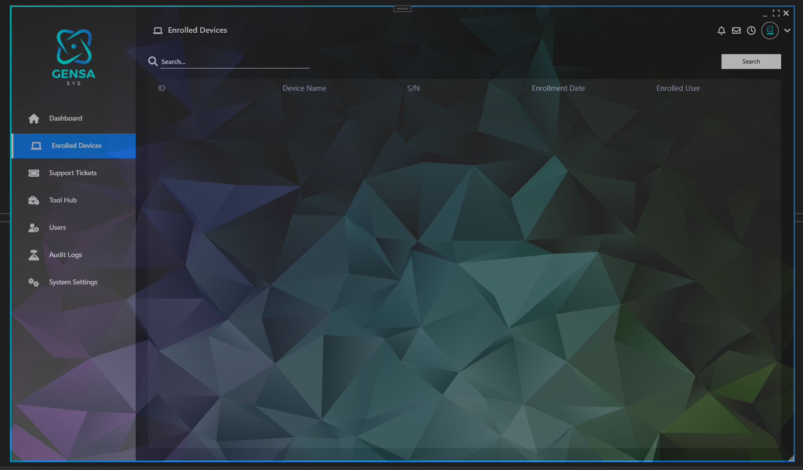

# GensaSys: IT Support Automation & Efficiency Suite (WIP)
GensaSys is a work-in-progress Windows application designed to empower IT support professionals and system administrators with essential tools for increased efficiency and streamlined workflows.

## Key Features (Planned):

Ticketing System: Manage support requests effectively with a centralized ticketing system featuring tracking, prioritization, and communication tools.
Device Database: Maintain a comprehensive repository of enrolled devices, including detailed hardware information, software configuration, and service history.
Admin Shortcuts: Access commonly used system management and troubleshooting tools directly from within the application, saving valuable time and effort.
Target Audience:

Windows IT Support Professionals
System Administrators
Network Administrators
Current Development Status:

This project is actively under development with the goal of releasing an early beta by the end of 2024.

Here is some screenshots of the current development: 

